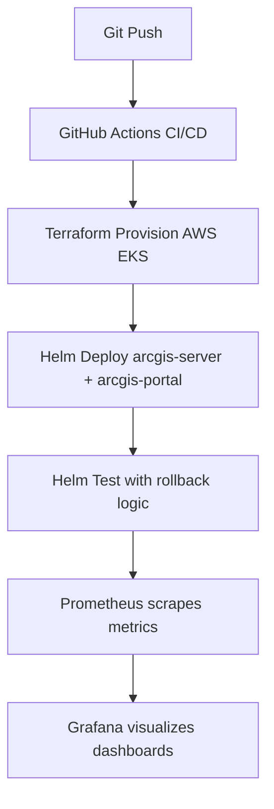

# 🌐 GitOps-Mock-ArcGIS: End-to-End Kubernetes GitOps Deployment

> A realistic, production-style simulation of **ArcGIS Enterprise** deployment using **GitOps principles**, inspired by [Esri's ArcGIS GitOps tooling](https://github.com/Esri/arcgis-gitops). This repo demonstrates a modular and declarative infrastructure setup using **Terraform**, **AWS**, **Helm**, and **Prometheus/Grafana** observability.

---

##  Table of Contents

- [Motivation](#motivation)
- [Esri GitOps Deployment Inspiration](#esri-gitops-deployment-inspiration)
- [Project Structure & Workflow](#project-structure--workflow)
- [Deploy It Yourself (DIY)](#deploy-it-yourself-diy)
  - [Prerequisites](#-prerequisites)
  - [Step-by-Step Workflow](#step-by-step-workflow)
- [Monitoring & Observability](#monitoring--observability)
- [Conclusion](#conclusion)


---

##  Motivation

The goal of this project is to simulate how **ArcGIS Server** and **Portal for ArcGIS** components could be deployed in a GitOps-style workflow using open-source tools and cloud-native infrastructure.

Inspired by Esri's internal practices, this mock deployment:
- Automates the full lifecycle: **Provision → Deploy → Monitor**
- Enables testing and rollback using **Helm**
- Integrates **Prometheus and Grafana** for real-time metrics
- Follows a CI/CD pipeline using **GitHub Actions**

---

##  Esri GitOps Deployment Inspiration

Esri maintains several deployment tools for ArcGIS Enterprise across:
- **PowerShell DSC** (for Windows)
- **Chef** (for Linux)
- **Helm Charts** (for Kubernetes)
- **GitHub Actions** for CI/CD pipelines

This repo focuses on the **Kubernetes + Helm** path and re-implements it using:
- A simplified **arcgis-server** (Redis-based) and **arcgis-portal** (Nginx-based)
- Kubernetes-native Helm tests for validation
- Metrics scraping via sidecar exporters
- GitHub Actions that mimic Esri’s pipeline flow

---

## Project Structure & Workflow

```bash
Gitops-Mock-ArcGIS/
│
├── CONTRIBUTING.md
├── LICENSE
├── README.md
├── config
│   └── aws
│       └── arcgis-enterprise-k8s
├── helm
│   ├── arcgis-portal
│   │   ├── Chart.yaml
│   │   ├── templates
│   │   │   ├── _helpers.tpl
│   │   │   ├── configmap.yaml
│   │   │   ├── deployment.yaml
│   │   │   ├── service.yaml
│   │   │   ├── serviceaccount.yaml
│   │   │   ├── servicemonitor.yaml
│   │   │   └── tests
│   │   │       └── smoke-test.yaml
│   │   └── values.yaml
│   └── arcgis-server
│       ├── Chart.yaml
│       ├── templates
│       │   ├── _helpers.tpl
│       │   ├── deployment.yaml
│       │   ├── service.yaml
│       │   ├── serviceaccount.yaml
│       │   ├── servicemonitor.yaml
│       │   └── tests
│       │       └── smoke-test.yaml
│       └── values.yaml
├── monitoring
│   ├── grafana-dashboards
│   │   ├── nginx-dashboard.json
│   │   └── redis-dashboard.json
│   ├── prometheus-values.yaml
│   ├── servicemonitor-portal.yaml
│   └── servicemonitor-server.yaml
├── overlays
│   ├── dev
│   │   ├── values-portal.yaml
│   │   └── values-server.yaml
│   └── prod
│       ├── values-portal.yaml
│       └── values-server.yaml
├── terraform
│   └── aws
│       ├── backend.tf
│       ├── main.tf
│       ├── outputs.tf
│       └── variables.tf
└── terraform.tfstate

```

 ## GitOps Workflow



##  Deploy It Yourself (DIY)

###  Prerequisites

Ensure the following tools are installed locally:

--- 
| Tool                  | Version Recommended |
|-----------------------|---------------------|
| Terraform             | 1.3.x+              |
| kubectl               | 1.26+               |
| Helm                  | 3.11+               |
| AWS CLI               | Configured with admin IAM credentials |
| GitHub Actions        | (Pre-configured workflows provided) |
| Docker (optional)     | If testing locally  |

---
###  Step-by-Step Workflow

⚠️ **Costs:** Stay within AWS Free Tier. Use t3.micro/t3.small instances where possible.

#### 1. Clone the Repository

```bash

git clone https://github.com/alleem18/Gitops-Mock-ArcGIS.git
cd Gitops-Mock-ArcGIS

```
#### 2. Configure Terraform Backend and AWS
Set up your terraform.tfvars and AWS credentials as per your IAM policy.

#### 3. Provision AWS Infrastructure

```bash
cd terraform
terraform init
terraform apply -auto-approve 
```
Resources created:

- VPC + Subnets

- EKS Cluster

- IAM roles + node groups

### 4. Deploy ArcGIS Components with Helm

```bash
cd ..
helm upgrade --install arcgis-server ./helm/arcgis-server --namespace default
helm upgrade --install arcgis-portal ./helm/arcgis-portal --namespace default
```
Helm tests will automatically run on post-install.

### 5. Validate Deployment (Optional)

```bash
kubectl get pods -n default
kubectl get svc -n default
helm test arcgis-server
helm test arcgis-portal
```

### 6. Monitoring & Observability

A. Grafana Access

-  Run the following to access Grafana on your localhost:

```bash
kubectl port-forward svc/monitoring-grafana 3000:80 -n monitoring
```

Then open: http://localhost:3000

- Default credentials:

- Username: admin

- Password: prom-operator or whatever is set in your Helm release

B. Prometheus Access

```bash
kubectl port-forward svc/monitoring-kube-prometheus-prometheus 9090:9090 -n monitoring
```
Then open: http://localhost:9090
 

C. Built-in Dashboards

- redis-dashboard.json: auto-imported for ArcGIS Server (Redis)

- nginx-exporter metrics visualized via Grafana panels

- helm test logs viewable from GitHub Actions logs

If custom dashboards don't appear, import them manually via Grafana UI using files in monitoring/grafana-dashboards/.

### 7. Clean-Up and Destroy Workflow
To reset everything (Terraform + Helm + Monitoring):


```bash
terraform destroy --auto-approve
helm uninstall arcgis-portal -n default
helm uninstall arcgis-server -n default
kubectl delete -f monitoring/servicemonitor-*.yaml
```

### Conclusion
This project simulates a full Esri-style GitOps deployment pipeline for ArcGIS Enterprise using open-source tools. Every component from infrastructure to app monitoring; is declaratively managed, CI/CD-driven, and observability-enabled.

It serves as both a learning tool and a reference implementation for teams aiming to build production-grade ArcGIS GitOps workflows using AWS, Terraform, Helm, and Prometheus stack.


